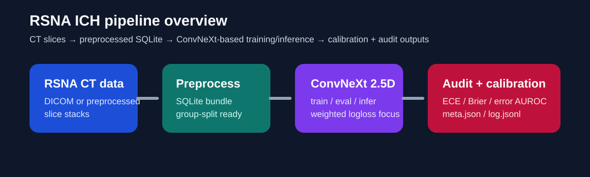
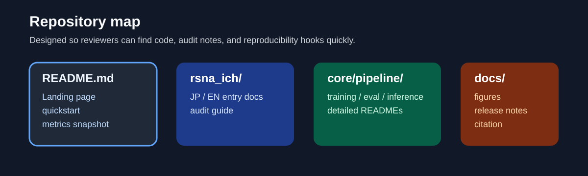
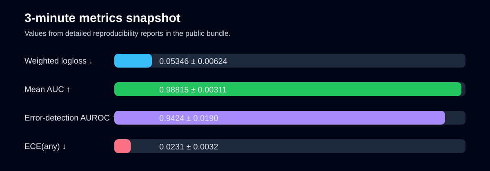

# rsna-ich-reproducible-pipeline

**言語:** 日本語 | [英語版](README.md)

RSNA ICH challenge 向けの、**再現可能な頭蓋内出血分類パイプライン**です。監査しやすいドキュメント、校正解析、リークを避けるグループ分割評価を含みます。

**クイックリンク**
- 英語版: [rsna_ich/README_en.md](rsna_ich/README_en.md)
- 日本語版: [rsna_ich/README.md](rsna_ich/README.md)
- 実験詳細: [core/pipeline/README.md](core/pipeline/README.md)
- API デモ概要: [docs/api_demo_ja.md](docs/api_demo_ja.md)
- 再現性チェックリスト: [docs/reproducibility_checklist.md](docs/reproducibility_checklist.md)
- GitHub About 設定原稿: [英語版](docs/github_about.md) | [日本語版](docs/github_about_ja.md)
- 引用情報: [CITATION.cff](CITATION.cff)
- リリースノート原稿: [英語版](docs/releases/v1.0-interview.md) | [日本語版](docs/releases/v1.0-interview_ja.md)
- ロードマップ: [ROADMAP.md](ROADMAP.md)

## このリポジトリでできること

- RSNA 頭蓋内出血分類の学習 / 評価ワークフロー
- `split_by=study` によるグループ分割とリーク監査
- `any` ラベルに対する校正評価と不確実性評価
- FastAPI による公開向け API schema デモ
- 外部レビュー向けに整理したポートフォリオ導線
- 実データなしで公開物の配線を確認できる簡易動作確認

## 想定している読者

- 医療AI実装を確認したい採用担当
- 監査しやすい医用画像ベースラインを見たい ML エンジニア
- 再現性重視の CT 分類プロジェクト構成を探している研究者

## 3分で分かる概要







### 代表指標

| 指標 | 値 | 意味 |
|---|---:|---|
| Weighted multi-label logloss | 0.05346 ± 0.00624 | Kaggle 互換の主評価指標 |
| Mean AUC | 0.98815 ± 0.00311 | 各クラスをまたいだ順位付け性能 |
| Error-detection AUROC (`any`) | 0.9424 ± 0.0190 | 不確実性による誤り検出性能 |
| ECE (`any`) | 0.0231 ± 0.0032 | 確率の校正品質 |

> 数値は同梱レポートに基づきます。医療データ本体は公開物に含めていません。

## 最短の確認方法

### 1. 実データなしで配線確認

```bash
python scripts/smoke_test.py --use_dummy_data
```

### 2. 配布物マニフェストを生成

```bash
cd core/pipeline
python tools/make_manifest.py
```

### 3. 実データで学習 / 評価

- 日本語詳細: [core/pipeline/README.md](core/pipeline/README.md)
- 英語版の詳細ガイド: [core/pipeline/README_en.md](core/pipeline/README_en.md)

### 4. API デモ面を確認

```bash
cd core/pipeline
python serve_rsna_ich_api.py
```

ポート `8000` が使用中なら `API_PORT=8011 python serve_rsna_ich_api.py` のように変更できます。

詳細: [docs/api_demo_ja.md](docs/api_demo_ja.md)

## 含まれるものと含まれないもの

含まれるもの:
- ソースコード
- 設定ファイル
- 監査 / 評価ドキュメント
- 静的図表と release note 原稿

含まれないもの:
- `Datasets/`
- `runs/`
- `results/`
- `logs/`

## 固定スナップショット（ポートフォリオ用）

開発は継続中ですが、ポートフォリオ / 面接レビュー用の固定版は次のタグです。

✅ `rsna-ich-v1.0-interview`

## 引用

[CITATION.cff](CITATION.cff) を参照してください。

## コミットメッセージの規約

今後の変更は Conventional Commits（`type: summary`）で揃えます。

- `fix: leakage check in group split`
- `feat: add calibration evaluation`
- `refactor: manifest validation logic`
- `docs: evaluation protocol clarification`
